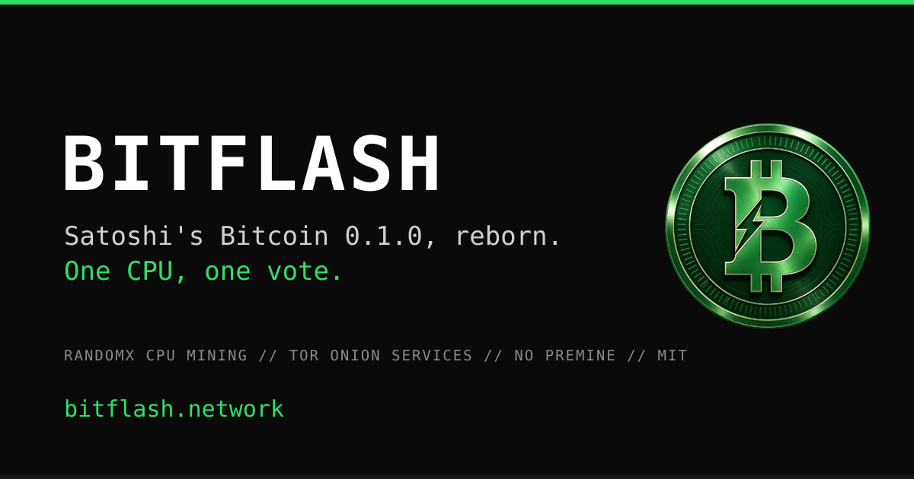

<div align="center">



# Bitflash `BTF`

CPU-only cryptocurrency. A revival of Bitcoin 0.1.0 with RandomX proof of work and anonymous `.btf` addressing over Nostr.

-2ea44f?style=for-the-badge)


**[Download](../../releases/latest)**

</div>

---

## What it is

Bitflash keeps Satoshi's original consensus rules and replaces two things:

**RandomX proof of work.** Memory-hard algorithm used by Monero. A laptop competes equally with a server. ASICs and GPUs have no advantage.

**Anonymous addressing.** Every node has a `.btf` address derived from its public key, similar to a Tor `.onion`. Nodes reach each other through encrypted rendezvous tunnels, so no port forwarding is needed and a node behind CGNAT works normally.

No premine. No ICO. 50 BTF per block, halving on schedule, 21M cap, ~2 minute blocks.

### What `.btf` does and does not hide

Worth being precise, because the difference matters if you are relying on it.

**A peer you reach over `.btf` does not learn your IP.** All outbound connections go through a rendezvous tunnel; there is no IP-based peer dialling left in the node. The relay forwards encrypted bytes and cannot read or alter them.

**The rendezvous relay does see your IP.** It has to — it is the thing your TCP connection terminates on. Relays are run by volunteers, so treat that as a party who knows you are on the network.

**The node still listens on 8433.** Nothing dials by IP any more, but the listener is still there, so anyone who already knows your address and can reach that port may connect directly. If that matters to you, firewall it.

This is unlinkability between peers, not anonymity against a network observer. It is not Tor.

---

## Quick start

Download the [latest release](../../releases/latest) and run. No install, no
configuration — it connects automatically and starts syncing.

**Linux:** make the `.AppImage` executable and run it.

**Windows:** extract the `-windows.zip` and run `Bitflash.exe`.

Every release ships a `SHA256SUMS` covering the assets. Verifying takes a second
and is worth doing:

```bash
sha256sum -c SHA256SUMS
```

For newer signed releases, verify the checksum file itself first:

```bash
gpg --verify SHA256SUMS.asc SHA256SUMS
sha256sum -c SHA256SUMS
```

The helper below downloads the release assets, verifies `SHA256SUMS.asc` when it
is present, then checks the hashes:

```bash
scripts/verify-release.sh latest
```

See [release verification](docs/release-verification.md) for the full release
audit flow and the maintainer signing step.

Bitflash also ships a deterministic UTXO-set commitment tool:

```bash
python3 scripts/verify-utxo-set.py --out utxo-report.json --json
```

It reconstructs the best chain from local block files, computes the current
UTXO root and supply, and writes canonical JSON that independent auditors can
compare or timestamp externally with OpenTimestamps. See
[UTXO-set commitments](docs/utxo-commitment.md).
Bitflash also ships a deterministic fair-launch verifier:

```bash
python3 scripts/verify-fair-launch.py --max-blocks 1000 --out bitflash-fair-launch-report.json --json
```

The report reads the local chain directly, checks the genesis launch baseline,
and produces canonical JSON whose hash can be compared by independent auditors
or timestamped externally with OpenTimestamps. See
[fair-launch verification](docs/fair-launch.md).

**Keep your node current.** Consensus rules have changed since the first
releases — 1.2.1 fixed a bug that let anyone spend anyone's coins, and 1.2.2
added a per-block signature-operation cap. A node on an older build will accept
blocks that current nodes reject, which puts it on a different chain without any
warning.

Two more reasons, both measured rather than theorised:

- **Before 1.2.13** a node closed a disconnected peer's socket twice and left the
  closed handle in its `select()` set, where it made `select()` fail on every
  iteration. The node then spent its socket loop in an error path instead of
  reading its peers — the deaf-node behaviour reported since 1.2.7. Two nodes
  side by side on one machine, same network: the one without the fix held 11
  peers and logged 741 spurious disconnections; the one with it held 21 and
  logged none. On 1.2.13 in production, two mining nodes hold 13 and 18 peers
  with zero.
- **Before 1.2.11** a long-running Windows node accumulated sockets it never
  released — 1262 of them in 26 hours on one machine, each holding an ephemeral
  port. Restarting returned them; upgrading stops them accumulating.

Your wallet and chain data live in `%APPDATA%\Bitflash` (Windows) or
`~/.bitflash` (Linux) and are shared by every version, so upgrading is just
replacing the binary. Never delete that directory to "fix" something without a
backup — it holds your keys.

---

## Your wallet: the phrase and the file

Since 1.2.12 a wallet can hold twelve words that rebuild it. Since 1.2.13 those
words also cover the address the window shows you. **Both still matter** — the
phrase and the file back up different things, and the difference is where people
lose money.

The derivation is written down in [docs/derivation.md](docs/derivation.md), with
test vectors and a script that reproduces them from scratch. It is there so the
twelve words keep working even if this software does not: paths, address format
and encoding, enough to recover the keys with ordinary tools and no Bitflash
code at all.

### The recovery phrase

```
bitflash -newphrase                          # create it, show it once, exit
bitflash -restorephrase="twelve words here"  # rebuild a wallet from it
```

`-newphrase` installs a BIP32 seed, derives the wallet's key pool and default
receiving address from it, and prints the words once. It refuses if a phrase
already exists: replacing one silently would strand every coin on addresses the
written-down words no longer describe.

`-restorephrase` installs the seed and walks forward in batches of a hundred
addresses, rescanning the chain after each and stopping when a whole batch turns
up nothing. `-restoredepth=N` looks further. `-showderived=N` lists the addresses
a phrase produces, so you can check one before trusting it.

The same two operations are in the window, under **Wallet Safety**.

**The words are printed to the terminal and nowhere else** — never to
`debug.log`, which is the file people are routinely asked to attach to an issue.

**What the phrase does not cover.** Keys that existed *before* the seed was
installed are random. They are not derived from it and they do not come back
from the words. The wallet names such an address `Your Address (created before
the recovery phrase)` so you can tell them apart. This is why file backups still
matter.

> **If you created a phrase on 1.2.12, run `-restorephrase` with the same twelve
> words.** That release installed the seed but left the visible address and the
> key pool random, so the wallet went on handing out addresses the words cannot
> reproduce while the window said a phrase existed. Restoring repairs it.

### The file

**Copying `wallet.dat` on its own is not a backup.** Berkeley DB ties the file
to the environment in the `database/` subdirectory beside it, so a lone
`wallet.dat` will not open elsewhere — the keys are all still in there, and the
file is refused anyway. Use the built-in command, which writes a copy that
stands on its own:

```
bitflash -backupwallet=/path/to/wallet-backup.dat
```

It loads the wallet, writes the copy, and exits without starting the node. If
you would rather copy by hand, shut the node down first and take the **whole**
data directory, not just `wallet.dat`.

A file backup covers what a phrase cannot: keys from before the seed, and any
key the wallet acquired by import. It also has a margin of its own — the wallet
keeps a pool of 100 pre-generated keys, so a backup covers the next 100 mining
rewards or receive addresses. Take a fresh one after mining for a while, after
creating many receive addresses, and before moving the wallet to another machine.

The GUI has a **Backup Wallet** button and a **Wallet Safety** view, which fills
the key pool before writing the backup.

### Finding coins the wallet never recorded

```
bitflash -rescan
```

Walks the chain for coins a key of yours owns but the wallet has no record of —
after importing keys, or after restoring a file from another machine.
`-importwallet` runs this automatically. A scan asked for with no chain data
loaded is refused rather than reported as "no transactions found", which reads
as a verdict to somebody who has just lost a wallet.

### When wallet.dat itself will not open

Everything above still runs through Berkeley DB. If the database is the thing
that is broken — a build that will not read it, a file truncated by a bad copy,
an environment beyond recovery — the keys are usually still fine, and you can
take them out as text:

```
bitflash -dumpwallet=/path/to/keys.txt
bitflash -importwallet=/path/to/keys.txt   # into any wallet, on any machine
```

One key per line with its address and label, no database and no environment.
Importing skips keys the wallet already holds, so running it twice is safe, and
an unreadable line is reported and stepped over rather than abandoning the rest.
Restart the node afterwards so it scans the chain for transactions belonging to
the new keys.

**The dump is your private keys in the clear.** Anyone who reads that file can
spend those coins. It is written owner-only on Linux and macOS; on Windows it
inherits whatever the containing folder allows, so choose the folder carefully.
Move it somewhere safe and delete the copy. `-dumpwallet` will not overwrite an
existing file.

---

## Mining

Open **Options** from the menu bar. Under Mining Mode:

**Solo** — mine directly to your wallet. Default.

**Operator** — run a pool. The pool server uses `.btf` rendezvous only. The window shows the pool's `.btf` address, discovered pools, and owed payouts.

Pool announcements are published on Nostr with live status fields, so external tools can query the latest pool state by `.btf` address.

Pool operators also write a local `pool_status.json` every ten seconds and a
`pool_rounds.json` proof ledger whenever they find blocks or pay miners. By
default both are created in the data directory; use `-poolstatusfile=PATH` and
`-poolroundsfile=PATH` to write them somewhere a dashboard or web sync can read.
The files are informational only: nodes still discover pools through Nostr and
`.btf`, not through any web domain.

**Participant** — mine to someone else's pool. Enter or select the pool's `.btf` address and enable Start Mining.

The built-in participant miner connects to operator pools through the `.btf`
path. External miners can use Bitflash as a local Stratum bridge:

```bash
./bitflash -nogui -stratumbridge=POOL_BTF_ADDRESS -stratumbridgeport=3333
SRBMiner-MULTI --algorithm randomx --pool 127.0.0.1:3333 --wallet YOUR_BTF_ADDRESS --password x
xmrig -a rx/0 -o 127.0.0.1:3333 -u YOUR_BTF_ADDRESS -p x
```

Estimate rewards and electricity cost locally:

```bash
python3 scripts/bitflash-mining-calculator.py \
  --hashrate 21 --hashrate-unit kh/s \
  --network-hashrate 1.56 --network-hashrate-unit mh/s \
  --watts 140 --kwh-cost 0.10 \
  --price 0.001 --pool-fee 1
```

See [mining calculator](docs/mining-calculator.md). Price is manual until
Bitflash has a reliable public market.

---

## Headless / server mode

```bash
./bitflash -nogui                     # node only
./bitflash -nogui -gen                # node + solo mining
./bitflash -nogui -gen -operator      # pool operator
./bitflash -nogui -gen -operator \
  -poolstatusfile=/var/www/pool_status.json \
  -poolroundsfile=/var/www/pool_rounds.json
./bitflash -nogui -gen -participant=POOL_BTF_ADDRESS  # mine to pool
./bitflash -nogui -stratumbridge=POOL_BTF_ADDRESS      # local bridge for XMRig/SRBMiner
```

Every option takes `-` or `/`. **Under MSYS2 use the `-` form** — the shell
rewrites a leading slash into a path before the node ever sees it.

**The mining mode is remembered between restarts** since 1.2.11, so a node that
was mining comes back mining. A `-gen`, `-operator` or `-participant` flag always
wins over what was stored, and the log says on every start which of the two
decided. Passing the flag anyway is the safe habit: it survives a wallet that
came from an older build.

Other options worth knowing:

```bash
-datadir=PATH    # wallet and chain data elsewhere
-port=N          # P2P listen port, default 8433
-debug           # verbose log; without it debug.log is nearly silent
-help            # full list
```

`-port` plus `-datadir` is what lets two nodes share one machine. Both are
needed — the data directory takes an exclusive lock, so a second node pointed at
the same one will refuse to start.

### When something looks wrong

**Menu > Diagnostics**, and the same report in `debug.log` every ten minutes:
peers held against peers `select()` is actually watching, blocks received and how
many arrived without a parent, the proof-of-work mode with the live miner thread
count, sockets by the part of the program that opened them, and per peer how long
since the last message each way. There is a copy button — if you open an issue,
paste that.

It exists because every hard problem in this project so far was found from
*outside* the node: sockets read over WMI from another machine, memory compared
against a number in a README, a `grep` over somebody's log. In each case the node
knew and had no way to say so.

As a systemd service:

```ini
[Unit]
Description=Bitflash node
After=network.target

[Service]
ExecStart=/opt/bitflash/bitflash -nogui -gen -operator
Restart=always
User=bitcoin
WorkingDirectory=/opt/bitflash

[Install]
WantedBy=multi-user.target
```

---

## How nodes find each other

A node publishes a **self-certifying descriptor**: its `.btf` address, an
encryption key, and the rendezvous relay where it is currently reachable, signed
with the key the address decodes to. Nobody can publish a descriptor for an
address they do not own, so a hostile relay can withhold descriptors but cannot
forge one.

Discovery runs on four layers, so no single failure takes the network down:

| | |
|---|---|
| **Nostr relays** | where descriptors are published and looked up |
| **Rendezvous relays** | the tunnel itself, where two nodes are paired |
| **Peer cache** | peers that answered last time, saved to `btfpeers.json` and dialled on start before any relay is contacted |
| **Peer exchange** | connected nodes hand each other signed descriptors, so discovery keeps working while relays are down |

Peer exchange carries the same signed descriptors, verified the same way, so a
peer passing one on is trusted for nothing.

The cache is what makes a restart fast: on a clean install the first peer takes
about 36 seconds, and on the next start about 2.

---

## Running a relay

Relays are the meeting points that let nodes behind NAT connect to each other. More relays make the network more resilient.

```bash
sudo bash relay/install-bitflash-relay.sh 8434
./bitflash -nogui -announcerelay=YOUR_PUBLIC_IP:8434
```

Relays forward encrypted bytes and cannot read or modify traffic.

---

## Build from source

**Linux:**
```bash
make linux
```
Installs deps via apt, builds libsecp256k1 and RandomX, produces `Bitflash-*.AppImage`.

**Windows (MSYS2 UCRT64):**
```bash
make windows
```
Installs deps via pacman, produces `Bitflash-*-windows.zip`.

---

## At a glance

| | |
|---|---|
| Ticker | BTF |
| Proof of work | RandomX (CPU, memory-hard) |
| Block time | ~2 minutes |
| Difficulty retarget | every 30 blocks (~1 hour) |
| Block reward | 50 BTF, halving every 210,000 blocks |
| Halving interval | **~292 days** at target block time |
| Max supply | 21,000,000 BTF |
| Coinbase maturity | 100 blocks (~3.3 hours) before mined coins can be spent |
| Max signature ops | 20,000 per block |
| P2P port | 8433 |
| Addressing | `.btf` rendezvous — see the caveats above |
| Premine | None |
| Pool server | Built-in — `.btf` rendezvous only |
| Wallet recovery | Twelve-word phrase (BIP39 + BIP32), plus file backup |

The halving interval is the number most people get wrong coming from Bitcoin.
Same 210,000 blocks, but at two minutes instead of ten, so it arrives in about
ten months rather than four years.

---

Experimental software. Young network. Don't put in more than you are willing to lose.

MIT. Built on Bitcoin 0.1.0 (Satoshi Nakamoto, 2009).
